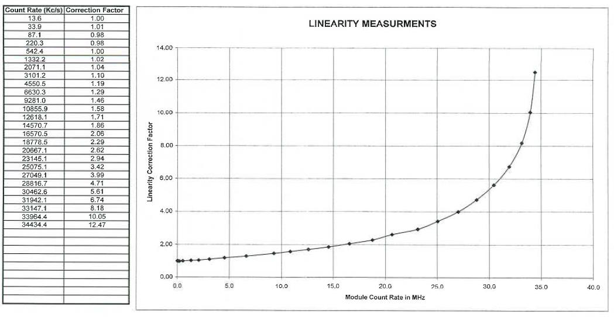

# mpl2nc

Convert Sigma Space Micro Pulse Lidar (MPL) data files and afterpulse, overlap
and dead time correction files to NetCDF.

mpl2nc is a Python program for converting binary MPL files to NetCDF4. The
converted variables closely follow those in the binary files. See the *Micro
Pulse LiDAR System Software Manual* for description of the original format and
variables. In contrast to the official SigmaMPL software, mpl2nc preserves the
native resolution of the data and allows easier batch operation on many input
files. The program can run on any operating system with Python 3. Raw lidar
backscatter is stored in the `channel_1` (cross-polarized) and `channel_2`
(co-polarized) variables.  Normalized relative backscatter (NRB) is calculated
from the raw backscatter (experimental). If afterpulse, overlap and dead time
correction files are supplied, the corrections are applied when calculating
NRB.

Note that the vendor-supplied dead time correction is known to be incorrect
in some instances. The dead time bin files use 32-bit floating point values
to store polynomial coefficients, which may be truncated due to the limited
precision of the data type. Using such dead time correction with mpl2nc or
the SigmaMPL software will result in wrong calibration. In such case please
use a CSV file with dead time correction polynomial curve values as specified in
the instrument's documentation ([see below](#dead-time-correction)).

## Usage

mpl2nc is a command line program to be run a terminal (Linux and macOS) or the
Command Prompt (Windows).

Synopsis:

`mpl2nc` [`-a` *afterpulse*] [`-d` *dead_time*] [`-o` *overlap*] [`-q`] [`-v`] [*input*] *output* \
`mpl2nc` `-h`|`--help`

Optional arguments:

- `-a` *afterpulse*: Afterpulse correction file (`.bin`).
- `-d` *dead_time*: Dead time correction file (`.bin` or `.csv`).
- `-h`, `--help`: Show help message and exit.
- `-o` *overlap*: Overlap correction file (`.bin`).
- `-q`: Run quietly (suppress output).
- `-v`: Show program's version number and exit.

Positional arguments:

- *input*: Input `.mpl` file or a directory containing `.mpl` files.
- *output*: Output `.nc` file or a directory where the resulting `.nc` files are written.

If *input* is not specified, only the correction files are converted and
written to *output*.

Currently only afterpulse correction file version 3 (SigmaMPL2013R1.0 and
later) is supported.

The dead time correction file can come either from the vendor-supplied `.bin` file
or from a CSV file created manually from a polynomial curve specified in the
instrument's documentation ([see below](#dead-time-correction)).

On Linux and macOS, see also the man page for information about usage:

```
man mpl2nc
```

## Examples

```sh
mpl2nc -a MMPL5054_Afterpulse_201903220500.bin -o MMPL5054_Overlap_201903270700.bin -d MMPL5054_SPCM34184_Deadtime7.bin 201803040300.mpl 201803040300.nc
```

Convert `201803040300.mpl` to `201803040300.nc` using correction files for afterpulse, overlap and dead time.

```sh
mpl2nc -a MMPL5054_Afterpulse_201903220500.bin -o MMPL5054_Overlap_201903270700.bin -d MMPL5054_SPCM34184_Deadtime7.bin in out
```

Convert MPL files in the directory `in` to NetCDF files in the directory `out` using correction files for afterpulse,  overlap  and  dead time.

```sh
mpl2nc -a MMPL5054_Afterpulse_201903220500.bin -o MMPL5054_Overlap_201903270700.bin -d MMPL5054_SPCM34184_Deadtime7.bin calibration.nc
```

Convert afterpulse, overlap and dead time correction files to the NetCDF file `calibration.nc`.

## Installation

It is recommended to run mpl2nc on Linux.

### Linux

On Debian-derived distributions (Ubuntu, Devuan, ...), install the required
system packages with:

```sh
sudo apt install python3 python3-pip pipx
```

On Fedora, install the required system packages with:

```sh
sudo yum install python3 pipx
```

Install mpl2nc:

```sh
pipx install mpl2nc
mkdir -p ~/.local/share/man/man1
ln -s ~/.local/pipx/venvs/mpl2nc/share/man/man1/mpl2nc.1 ~/.local/share/man/man1/
```

Make sure that `$HOME/.local/bin` is included in the `PATH` environment
variable if not already. This can be done with `pipx ensurepath`.

You should now be able to run `mpl2nc` and see the manual page with `man mpl2nc`.

To uninstall:

```sh
pipx uninstall mpl2nc
rm ~/.local/share/man/man1/mpl2nc.1
```

### macOS

Open the Terminal. Install mpl2nc with:

```sh
python3 -m pip install mpl2nc
```

Make sure that `/Users/<user>/Library/Python/<version>/bin` is included in the
`PATH` environment variable if not already, where `<user>` is your system
user name and `<version>` is the Python version. This path should be printed
by the above command. This can be done by adding this line to the file
`.zprofile` in your home directory and restart the Terminal:

```sh
PATH="$PATH:/Users/<user>/Library/Python/<version>/bin"
```

You should now be able to run `mpl2nc` and see the manual page with `man mpl2nc`.

To uninstall:

```sh
python3 -m pip uninstall mpl2nc
```

### Windows

Install [Python 3](https://www.python.org). In the installer, tick `Add
python.exe to PATH`.

Open Command Prompt from the Start menu. Install mpl2nc with:

```sh
pip install mpl2nc
```

You should now be able to run `mpl2nc`.

To uninstall:

```sh
pip uninstall mpl2nc
```

## NetCDF output description

### Dimensions

- profile – backscatter profile
- range – backscatter range
- ap_range – afterpulse range
- ol_range – overlap range

### Variables

#### Constants

| Variable | Description | Units | Comment |
| - | - | - | - |
| ap_background_average_copol | afterpulse co pol background average | count.µs<sup>-1</sup> | |
| ap_background_average_crosspol | afterpulse cross pol background average | count.µs<sup>-1</sup> | |
| ap_energy | afterpulse energy | µJ | |
| ap_file_version | afterpulse file version | | |
| ap_header | afterpulse header | | |
| ap_number_bins | afterpulse number of bins | count | |
| ap_number_channels | afterpulse number of channels | count | |
| c | speed of light | m.s<sup>-1</sup> | |
| dt_coeff | dead time coefficient | | N coefficients of polynomial degree N-1 in decreasing order |
| dt_coeff_degree | dead time coefficient degree | count | |
| dt_number_coeff | dead time number of coefficients | count | |
| ol_number_bins | overlap number of bins | count | |

#### 1D (ap_range)

| Variable | Description | Units | Comment |
| - | - | - | - |
| ap_copol | afterpulse co pol values | count.µs<sup>-1</sup> | |
| ap_crosspol | afterpulse cross pol values | count.µs<sup>-1</sup> | |
| ap_range | afterpulse range | km | |

#### 1D (ol_range)

| Variable | Description | Units | Comment |
| - | - | - | - |
| ol_overlap | overlap values | | |
| ol_range | overlap range | km | |

#### 1D (profile)

| Variable | Description | Units | Comment |
| - | - | - | - |
| ad_data_bad_flag | A/D data bad flag | | `0`: A/D data good, `1`: A/D data probably out of sync. Energy monitor collection is not exactly aligned with MCS shots. |
| azimuth_angle | azimuth angle | degrees | Azimuth angle of scanner. |
| background_average | background average | count.µs<sup>-1</sup> | Background Average for Channel #1. |
| background_average_2 | background average (channel 2) | count.µs<sup>-1</sup> | Background Average for Channel #2. |
| background_stddev | background standard deviation | count.µs<sup>-1</sup> | Background Standard Deviation for Channel #1. |
| background_stddev_2 |  background standard deviation (channel 2) | count.µs<sup>-1</sup> | Background Standard Deviation for Channel #2. |
| bin_time | bin time | s | Bin width (100, 200, or 500 nanoseconds). |
| compass_degrees | compass degrees | degrees | Compass degrees (currently unused). |
| data_file_version | data file version | | Version of the file format. |
| elevation_angle | elevation angle | degrees | Elevation angle of scanner. |
| energy_monitor | energy monitor | mJ | Mean of the Energy Monitor readings * 1000. |
| first_background_bin | first background bin | | Used primarily for MiniMPL (will always be 0 for normal MPL as background is collected pre-trigger). |
| first_data_bin | first data bin | | Bin # of the first return data. |
| gps_altitude | GPS altitude | m | GPS altitude (optional). |
| gps_latitude | GPS latitude | degrees north | GPS latitude (optional). |
| gps_longitude | GPS longitude | degrees east | GPS longitude (optional). |
| mcs_mode | MCS mode | | MCS mode register. |
| num_background_bins | number of background bins | count | Number of background bins following First Background Bin. |
| number_channels | number of channels | count | MCS Channels collected. Either 1 or 2. |
| number_data_bins | number of data bins | count | | Number of data bins (not background) following First Data Bin. |
| polarization_voltage_0 | polarization voltage 0 | | Not used. |
| polarization_voltage_1 | polarization voltage 1 | | Not used. |
| range_calibration | range calibration | m | Default is 0; will indicate range calibration offset measured for particular unit. |
| scan_scenario_flags | scan scenario flags | | `0`: No scan scenario used, `1`: Scan scenario used]. |
| shots_sum | shots sum | count | Number of laser shots collected. |
| sync_pulses_seen_per_second | sync pulses seen per second | count.s<sup>-1</sup> | MiniMPL Only; indicates average number of laser pulses seen to validate if laser is operating correctly. |
| system_type | system type | | `0`: Normal MPL, `1`: MiniMPL. |
| temp_0 | A/D #0 mean | | Mean of the A/D #0 readings * 100. |
| temp_1 | A/D #1 mean | | Mean of the A/D #1 readings * 100. |
| temp_2 | A/D #2 mean | | Mean of the A/D #2 readings * 100. |
| temp_3 | A/D #3 mean | | Mean of the A/D #3 readings * 100. |
| temp_4 | A/D #4 mean | | Mean of the A/D #4 readings * 100. |
| time | time | seconds since 1970-01-01 00:00:00 | Record collection time. |
| time_utc | UTC time | ISO 8601 | Record collection time (UTC). |
| trigger_frequency | trigger frequency | Hz | Laser fire rate (usually 2500). |
| unit | unit | | Unique number for each data system. |
| version | version | | Software version of the EXE that created this file. If the SigmaMPL.exe version is 3.00 then this value would be 300. |
| ws_barometric_pressure | barometric pressure | hPa | Weather station barometric pressure. |
| ws_dewpoint | dewpoint temperature | ℃ | Weather station dewpoint. |
| ws_inside_humidity | inside humidity | percent | Weather station inside humidity. |
| ws_inside_temp | inside temperature | ℃ | Weather station inside temperature. |
| ws_outside_humidity | outside humidity | percent | Weather station outside humidity. |
| ws_outside_temp | outside temperature | ℃ | Weather station outside temperature. |
| ws_rain_rate | rain rate | mm.h<sup>-1</sup> | Weather station rain rate. |
| ws_used | weather station used | | `0`: Weather station not used, `1`: Weather station used. |
| ws_wind_direction | wind direction | degree | Weather station wind direction. |
| ws_wind_speed | wind speed | km.h<sup>-1</sup> | Weather station wind speed. |

#### 2D (profile × range)

| Variable | Description | Units | Comment |
| - | - | - | - |
| channel_1 | channel #1 data | count.µs<sup>-1</sup> | For MPL systems without POL-FS option, the return signal array is stored here. For MPL systems with the POL-FS option, the cross-polarized return signal array is stored here. |
| channel_2 | channel #2 data | count.µs<sup>-1</sup> | Used only with POL-FS option. The co-polarized return signal array is stored here. |
| nrb_copol | copol normalized relative backscatter | count.µs<sup>-1</sup>.µJ<sup>-1</sup>.km<sup>2</sup> | Experimental. |
| nrb_crosspol | crosspol normalized relative backscatter | count.µs<sup>-1</sup>.µJ<sup>-1</sup>.km<sup>2</sup> | Experimental. |

### Attributes

| Variable | Description |
| - | - |
| created | UTC time in ISO 8601 format when the file was created. |
| software | Software identification (`mpl2nc (https://github.com/peterkuma/mpl2nc)`). |
| version | mpl2nc version. |

## Additional information

### Range calculation

Range can be calculated as `0.5*bin_time*c*([0, ..., n - 1] + 0.5)`,
where `n` is the number of bins.

### NRB

mpl2nc uses the following formula to calculate NRB:

```python
nrb_copol = (channel_2*dtcf(channel_2) - background_average_2*dtcf(background_average_2) -
            ap_copol*dtcf(ap_copol)*energy_monitor*1e-3/ap_energy +
            ap_background_average_copol*dtcf(ap_background_average_copol)*energy_monitor*1e-3/ap_energy)*
            range**2/(ol_overlap*energy_monitor*1e-3)
nrb_crosspol = (channel_1*dtcf(channel_1) - background_average_1*dtcf(background_average_1) -
               ap_crosspol*dtcf(ap_crosspol)*energy_monitor*1e-3/ap_energy +
               ap_background_average_crosspol*dtcf(ap_background_average_crosspol)*energy_monitor*1e-3/ap_energy)*
               range**2/(ol_overlap*energy_monitor*1e-3)
```

where `range` is range in m and dtcf is a function which calculates the dead
time correction factor for given photon counts. The correction fields
are interpolated on the data range.

### Dead time correction

A CSV file with dead time correction values can be supplied with the `-d` option.
This can be created from a dead time correction polynomial curve table supplied
with the instrument. For example:



The CSV file should contain two columns: `count` (in Kc/s) and `factor`
(unitless). The values should be as specified in the table for your particular
instrument. For the above example, the content of the
[CSV file](dt-example/dt.csv) should be:

```csv
count,factor
13.6,1.00
33.9,1.01
87.1,0.98
220.3,0.98
542.4,1.00
1332.2,1.02
2071.1,1.04
3101.2,1.10
4550.5,1.19
6630.3,1.29
9281.0,1.46
10855.9,1.58
12618.1,1.71
14570.7,1.86
16570.5,2.06
18778.5,2.29
20667.1,2.62
23145.1,2.94
25075.1,3.42
27049.1,3.99
28816.7,4.71
30462.6,5.61
31942.1,6.74
33147.1,8.18
33964.4,10.05
34434.4,12.47
```

## License

This software can be used, modified and distributed freely under the terms of
an MIT license (see [LICENSE.md](LICENSE.md) in the source distribution).

## Release notes

Version numbering follows [Semantic Versioning](https://semver.org/).

### 1.3.6 (2023-08-19)

- Installation with pipx.
- Improved list of dependencies in setup.py.
- Dropped support for Python 2.7.

### 1.3.5 (2020-07-18)

- Fixed installation on Windows.

### 1.3.3 (2020-02-02)

- Python 3 compatibility.

### 1.3.2 (2020-02-01)

- mpl2nc man page.

### 1.3.1 (2020-02-01)

- When input is a directory convert files in alphabetical order.

### 1.3.0 (2020-02-01)

- Fixed NRB issues (swaped channels and incorrect application of the dead time
correction).
- Fixed command line argument processing.

### 1.2.0 (2019-12-20)

- Support for afterpulse, overlap and dead time correction files.
- NRB (experimental).

### 1.1.1 (2018-04-19)

- Fixed type conversion bug on Windows.

### 1.1.0 (2018-04-18)

- Added global file attributes.
- Fixed syntax error in the script.

### 1.0.0 (2018-04-18)

- Initial version.

## Contact

For support or reporting bugs contact Peter Kuma <<peter@peterkuma.net>>.

## See also

[ALCF](https://alcf-lidar.github.io),
[ccplot](https://ccplot.org),
[ccbrowse](https://github.com/peterkuma/ccbrowse),
[cl2nc](https://github.com/peterkuma/cl2nc),
[mrr2c](https://github.com/peterkuma/mrr2c)
